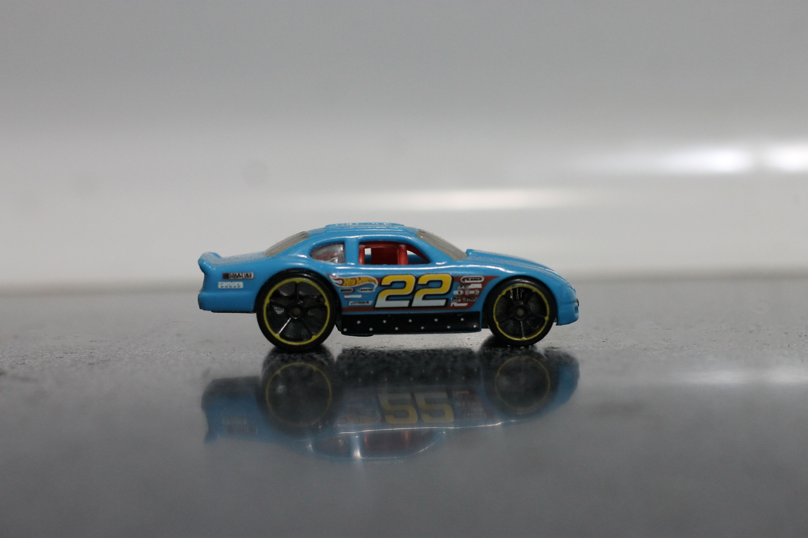

  

# 💫 About Me:
Always innovating and building something impactful Currently working on Artificial Intelligence and Machine Learning applications. Fun Fact: I spend my spare time reading about cars, geopolitics and warships or playing chess.

## 🌐 Socials:

   

# 💻 Tech Stack:

<!---->

# 📊 GitHub Stats:
<!-- -->
 

### ✍️ Something to think about

<picture>
  <source media="(prefers-color-scheme: dark)" srcset="https://raw.githubusercontent.com/AryanKo/AryanKo/output/github-snake-dark.svg" />
  <source media="(prefers-color-scheme: light)" srcset="https://raw.githubusercontent.com/AryanKo/AryanKo/output/github-snake.svg" />
  
</picture>
